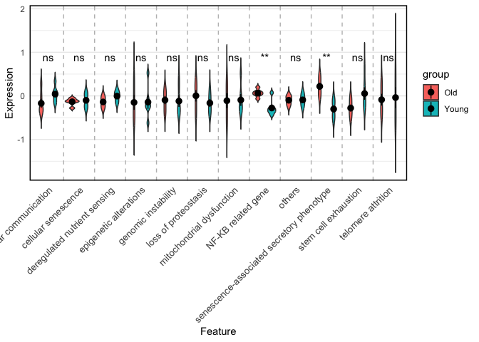
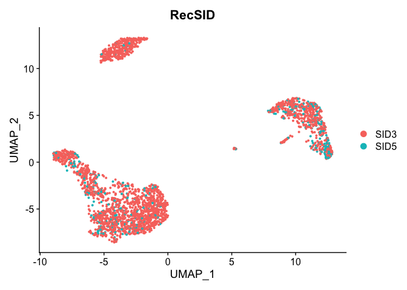

<!-- README.md is generated from README.Rmd. Please edit that file -->

# seneR 

<!-- badges: start -->
<!-- badges: end -->

## Overview

seneR is an open-source R package for assessing the senescence level of
samples based on RNA-seq counts data. Using this tool, researchers can
quickly obtain quantitative assessments of senescence and
senescence-related phenotypes, thereby gaining biological insights. For
single-cell RNA-seq, this tool can also identify senescent and
non-senescent cells, and draw senescence trajectories, which is
beneficial for understanding the cell senescence process. The tool is a
valuable shovel for mining biological insights of senescence from the
vast repository of omics data.

## Installation

You can install the development version of seneR like so:

``` r
{r,eval=FALSE}
if (!requireNamespace("pacman", quietly = TRUE))
    install.packages("pacman")
library(pacman)
pacman::p_load(GSEABase, GSVA, dplyr, tidyverse)
devtools::install_github("dr-yi-zhang/seneR")
```

## Usage

### Load the seneR environment:

``` r
library(seneR)
env_Load() 
#> [1] "Setting up virtual environment..."
#> Using virtual environment 'myenv' ...
#> [1] "Virtual environment setup and dependencies installed."
```

### Input RNA-seq data

Read the bulk RNA-seq sample data provided by this package (raw counts &
metadata):

``` r
example_expr <- read.csv(system.file("demo", "GSE246425_counts.csv", package = "seneR"),row.names = 1)
example_expr[1:4,1:4]
#>           GSM7868701_Young_Male_A GSM7868702_Young_Male_B
#> 5S_rRNA                         1                       6
#> 5_8S_rRNA                       0                       0
#> 7SK                             9                       4
#> A1BG                           54                      41
#>           GSM7868703_Young_Female_A GSM7868704_Young_Female_B
#> 5S_rRNA                           1                         6
#> 5_8S_rRNA                         0                         0
#> 7SK                               4                         7
#> A1BG                             33                        24
example_meta <- read.csv(system.file("demo", "GSE246425_meta.csv", package = "seneR"),row.names = 1)
head(example_meta)
#>                           group gender
#> GSM7868701_Young_Male_A   Young   Male
#> GSM7868702_Young_Male_B   Young   Male
#> GSM7868703_Young_Female_A Young Female
#> GSM7868704_Young_Female_B Young Female
#> GSM7868705_Young_Male_A   Young   Male
#> GSM7868706_Young_Male_B   Young   Male
```

The example dataset (GSE246425) is a bulk RNA-seq dataset of
chondrocytes isolated and cultured from human cartilage, including young
group (passage 1-3) and old group (serial passaging to passage 15-18).

### Senescence level (SID score) assessment:

The machine learning-based prediction model can automatically identify
the senescence prediction model (SID1~6) suitable for each input sample
and calculate the senescence score (SID score).(Tao, Yu, and Han 2024)

``` r
SID_res <- SenCID(example_expr)
#> Loading models of SID1...
#> Making predictions of SID1...
#> Loading models of SID2...
#> Making predictions of SID2...
#> Loading models of SID3...
#> Making predictions of SID3...
#> Loading models of SID4...
#> Making predictions of SID4...
#> Loading models of SID5...
#> Making predictions of SID5...
#> Loading models of SID6...
#> Making predictions of SID6...
#> Loading Recommend model...
#> Finished. Giving SID scores and SID Recommendation...
score_res <- SID_res$score_res
```

Plot boxplots based on the grouping of Meta information:

``` r
plot_group(score_res, example_meta, 'group','SID_Score',comparisons = list(c('Old','Young')))
```


From the plot, we can see that the senescence level of the old group is
significantly higher than that of the young group.

### Senescence-related phenotype assessment:

Based on the collected genes associated with various aging-related
phenotypes (such as genomic instability, stem cell exhaustion,
mitochondrial dysfunction, etc.), we organized them into gene sets and
achieved quantitative evaluation of various aging-related phenotypes
through the GSVA algorithm.

``` r
gsva_res <- seneGSVA(example_expr)
#> ℹ GSVA version 2.0.5
#> ! 21175 genes with constant values throughout the samples
#> ! Genes with constant values are discarded
#> ℹ Calculating GSVA ranks
#> ℹ GSVA dense (classical) algorithm
#> ℹ Row-wise ECDF estimation with Poisson kernels
#> ℹ Calculating GSVA column ranks
#> ! No annotation metadata available in the input expression data object
#> ! Attempting to directly match identifiers in expression data to gene sets
#> ℹ Calculating GSVA scores
#> ✔ Calculations finished
```

Plot violin plot based on the grouping of Meta information:

``` r
plot_violin(gsva_res,example_meta,'group')
```



From the figure, we can see that not all phenotypes are different
between the two groups. Among them, the levels of NF-kB and SASP in the
old group were significantly higher than those in the young group, which
is consistent with the conclusions of previous osteoarthritis studies.

### For scRNA-seq data

The Seurat package is the most widely used R package for scRNA-seq
analysis on R, and the following is an example of the use of seneR with
a seurat object. Of course, users can also input their own seurat
objects or a separate count matrix.

``` r
library(Seurat)
# Use the sample seurat object provided by SeuratData
library(SeuratData)
options(timeout = 600)
SeuratData::InstallData("pbmc3k")
pbmc3k <- LoadData("pbmc3k", type = "pbmc3k.final")
```

Calculate the SID score for each cell

``` r
expr_matrix <- GetAssayData(pbmc3k,layer = "counts")
SID_res <- SenCID(expr_matrix,binarize = TRUE) # "binarize" can distinguish cell senescent/non-senescent by binary classification
#> Loading models of SID1...
#> Making predictions of SID1...
#> Loading models of SID2...
#> Making predictions of SID2...
#> Loading models of SID3...
#> Making predictions of SID3...
#> Loading models of SID4...
#> Making predictions of SID4...
#> Loading models of SID5...
#> Making predictions of SID5...
#> Loading models of SID6...
#> Making predictions of SID6...
#> Loading Recommend model...
#> Finished. Giving SID scores and SID Recommendation...
pbmc3k@meta.data <- cbind(pbmc3k@meta.data,SID_res$score_res) # Add the evaluation results to the metadata
```

Visualizing senescence assessment results

``` r
VlnPlot(pbmc3k, features = "SID_Score", group.by = "seurat_annotations")
```


``` r
DimPlot(pbmc3k)
```


``` r
DimPlot(pbmc3k, group.by = "RecSID")
```



``` r
DimPlot(pbmc3k, group.by = "Binarization") #Visualizing senescent/non-senescent cells. 1 for senescent and 0 for non-senescent.
```


``` r
FeaturePlot(pbmc3k, features = "SID_Score")
```


Plotting the trajectory of senescence

This function draws the senescence trajectory of cells by fitting
differentially expressed genes with SID score.

``` r
library(monocle)
seneCDS <- sene_traject(pbmc3k,color = "SID_Score",cores = 7)
```


``` r
seneCDS <- sene_traject(pbmc3k,color = "seurat_annotations",cores = 7) #Gain insights by observing annotated cell subpopulations on trajectories
```


Finding genes that have a kinetic tendency associated with senescence by
plotting a heat map

This function draws the senescence trajectory of cells by fitting
differentially expressed genes with SID score.

``` r
sene_heatmap(seneCDS, num = 20, num_clusters = 3) #Set the number of genes to be displayed and the number of clustered expression patterns
```


## Feedback

For questions, comments, or any other feedback, please contact the
developers (<2211563@tongji.edu.cn>).

## Contributing

Contributions are welcome! Please open an issue or submit a pull request
on GitHub.

## References

<div id="refs" class="references csl-bib-body hanging-indent"
entry-spacing="0">

<div id="ref-tao2024" class="csl-entry">

Tao, Wanyu, Zhengqing Yu, and Jing-Dong J. Han. 2024. “Single-Cell
Senescence Identification Reveals Senescence Heterogeneity, Trajectory,
and Modulators.” *Cell Metabolism* 36 (5): 1126–1143.e5.
<https://doi.org/10.1016/j.cmet.2024.03.009>.

</div>

</div>
